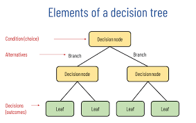

# Decision Tree

This is also a classification algorithm that creates a structure that reminds a tree, because the relationship between of the data. The target variable needs to be evaluate based on their branchs (childs) where we'll decided which better path to follow until we can know the best outcome of the data analisy.

To create the structure of a decision tree we can use the formula of Information gain, that is a decrease in entropy. So in the group of data, those that have the best gain of information will be the first branch of the tree, so that, follow for the next variable that had the second best value for the information gain.

## Entropy Formula
- E = -∑ p(i) * log2 p(i) - ***p is the probability***

Information Gain Formula
- IG = Entropy(father) -∑ (weight.f * Entropy(child))

Another algorithm that can help us to build a decision tree is called GINI Index, as well as the Entropy calculation and information gain formula, we'll use this for classification problems. Bellow you can see its mathematic formula.

## GINI Formula
- GINI = 1 - ∑ p(i)²

We must to apply this formula for all predict variable in the dataset, and for all of them we'll split even in two classes even though the values are coninuous (numerics), is this case, we'll need to find out the best point to split this numeric sequency in two groups of them.

## Avoinding with the Overfitting
When building a decision tree structure it is important to know when o stop. Although deeper we go to in the structure the data will be more organized, perhaps in just one specific classe or sample, this can make your model strongly specific and suffering from overfitting. Remember that the model needs to be generic enough to support new data, in this case the test data... so if you create a very specific model probablly you will have problems explaining new data.

## Regression Problems
Normally decision tree is associated to solve problems of classification, it resolves regressions problems also. For to do this it'll use the average and standart deviation calculation behind the scenes.
The formula for create decision tree to solve regression problems is:

∑ p(c) * S(c) ***S is the Standart Deviation***

## Split Algorithm
When we have in the dataset a continuos values variable we must need to split them in two classes, as I mentioned above. In the case of this samples, as I'm using Python, the default algorithm to do it will be the [Cart Algorithm](https://www.geeksforgeeks.org/cart-classification-and-regression-tree-in-machine-learning/). This algorithm working spliting all sample of the data from the first sample to the last one in the range calculating the average between the split parts and after calculating the cost function to figure out the best threshold for her.